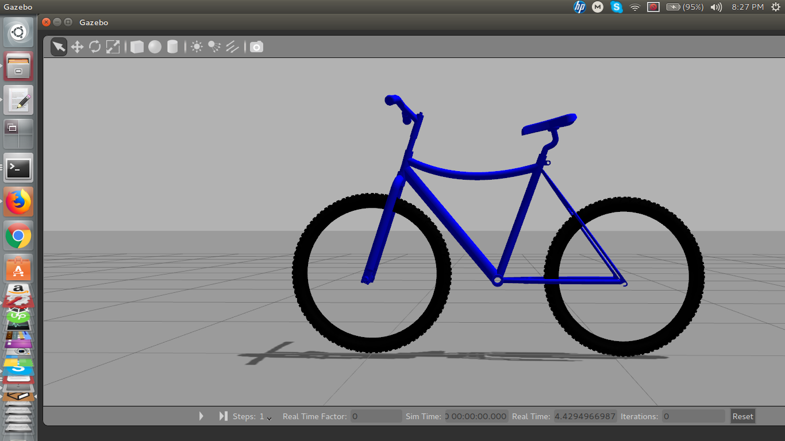

## A Gazebo Model of Bicycle
### MD Muhaimin Rahman
contact: sezan92[at]gmail[dot]com </br>

In this project, I have built a Gazebo model of a bicycle from scratch. The version is ```ros indigo``` in ```Ubuntu 14.04```.
My goal is to do research on self-balancing-bicycle. It is the first step. Any contributions are welcome. The video is available [here](https://youtu.be/UdAazZF2rBs). 


### Compiling the simulation

* Download the repo and keep it in your catkin workspace ```src``` folder
* Open a terminal and run ```catkin_make```
* Open a terminal and run ```roslaunch bicycle_gazebo main.launch```

The simulation should look like the image above


